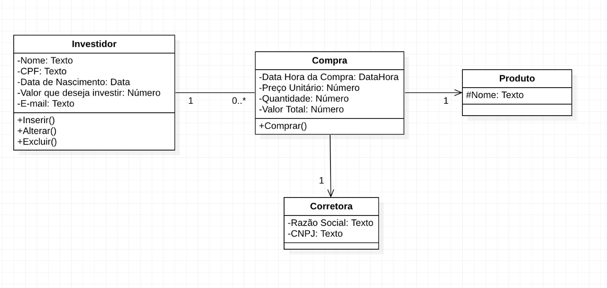

# Processo Seletivo 2021

Bem-vindo ao exame técnico para o processo seletivo da Juridics.
Em primeiro lugar, agradecemos pelo seu interesse e sua disponibilidade em realizar mais esta etapa do processo seletivo.
Consideramos fundamental esta etapa do processo, pois permitirá que tanto você quanto a Juridics se conhecam um pouco melhor.

Desde já, salientamos que este exame irá medir o seu nível de "se virômetro", ou seja, o quanto é capaz de encontrar
soluções no dia a dia. Portanto, você está livre para pesquisar na Internet e até mesmo copiar códigos dos outros.
Porém, apresente um código final legível, entendível e organizado, pois isso será usado como critério de avaliação.

Para realizar este exame, primeiramente, crie um FORK deste repositório na sua conta pessoal e faça commit de todas as respostas neste FORK.
Este exame é composto de 5 questões, e cada resposta deve ser colocada na sua respectiva pasta.

### Questão 1) Desenvolva uma função *em javascript* para verificar se é número primo
Um número é classificado como primo se ele é maior do que 1 e divisível apenas por 1 e por ele mesmo.
A função deve receber como entrada um número inteiro e devolver como saída um true quando o número for primo e false quando não for. 
A função não deve permitir receber números acima de 100, quando isso acontecer devolva uma exceção.

### Questão 2) Desenvolva *em java* as classes que representam um modelo conceitual
Transcreva para classes java o modelo conceitual abaixo, observe os padrões de nomenclaturas e os tipos convencionados em Java.
Dentro dos métodos das classes não deve conter nenhuma implementação.
Tome cuidado com a cardinalidade e navegabilidade dos relacionamentos entre classes, pois isso gera consequências no código.

### Questão 3) Desenvolva *em python* endpoints REST para cadastro de investidor
Crie 3 endpoints que serão usados para inserir, alterar e remover investidor.
Atenção aos pontos abaixo: 
 - É permitido utilizar frameworks python, tais como: Flask, Django e outros;
 - Não deve ser utilizado banco de dados (relacional ou NoSQL), mas os dados devem ser mantidos na memória ou em disco através de arquivo texto;
 - O cadastro de investidor deve conter os seguintes campos: nome, CPF, email, data de nascimento e valor que deseja investir.

Atenção: crie o arquivo requirements.txt para registrar as libs.

### Questão 4) Desenvolva uma função *em python* para calcular se duas frases são similares
A função deve receber duas frases no *idioma Inglês* como entrada. Devem ser utilizadas frases curtas de até 300 caracteres cada,
e devolver o nível de similaridade entre as frases. Este nível (score) normalmente é um número entre 0 e 1, onde quanto mais perto de
1 mais similar e quanto mais perto de 0 menos similar.
Existem algumas libs que fazem isso em python, descubra quais são e aprenda a utilizá-las.

Atenção: crie o arquivo requirements.txt para registrar as libs.

### Questão 5) Desenvolva *html e css* a tela de exemplo
Crie uma tela utilizando somente HTML e CSS o mais parecido possível com o desenho a seguir.

